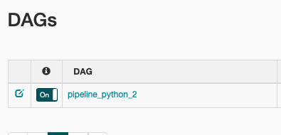
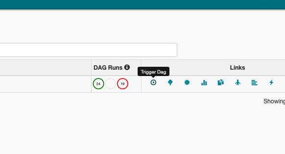

# Yet Another Scalable Apache Airflow With Docker Example Setup
This repository contains the code for article (to be added). It features an scaffold of Apache Airflow, whose workers instead of executing the job themselves, run Docker containers and wait until they complete.

# Requirements
* Linux or MacOS
* Docker and docker-compose
* Python 3.6 (with `docker-py` installed)

# How to run example
* clone the project
* go to `./airflow/` and run `docker build . -t puckel-airflow-with-docker-inside:latest`
* make sure you have [docker-py](https://github.com/docker/docker-py) and run `python build_images.py`
* go to `./airflow` and run `docker-compose up`
* launch http://localhost:8080/admin/, ensure that DAG is ON:

* trigger the DAG:

* watch the pipeline as it launches Docker containers:

# Modify
* feel free to make PR's
