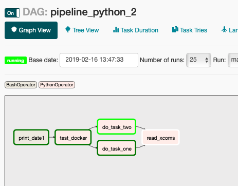
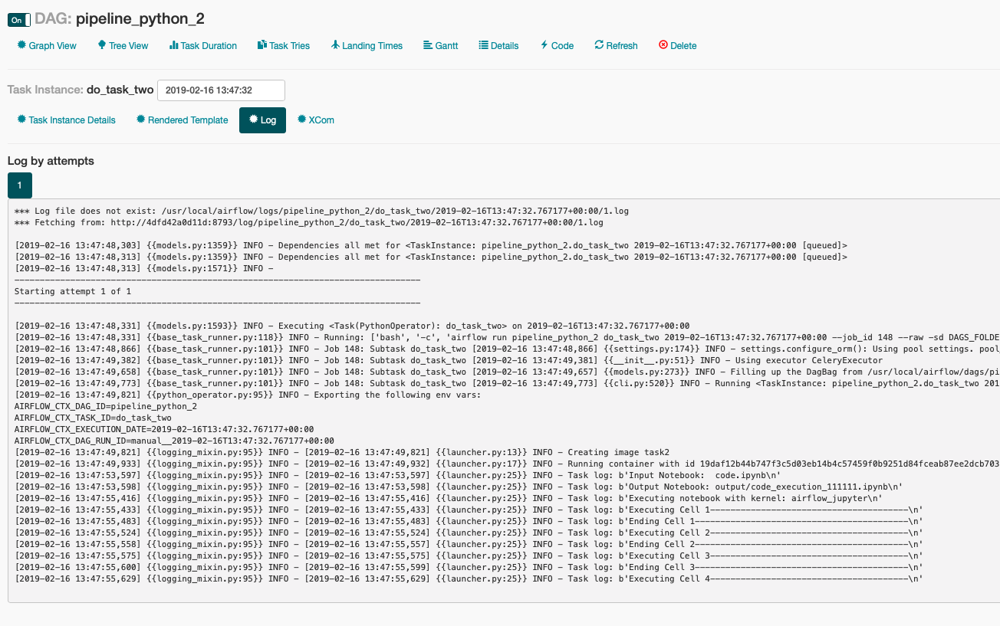

# Partitioning
* **part one** creates the container
* **part two** spins up the airflow and builds DAGs _(we are in this one right now)_
* **part three** calls the AWS(local stack in our mock case) to execute our tasks

# Flow
We will be using Docker Apache Airflow version.

First, download the docker-compose-CeleryExecutor.yml from here https://github.com/puckel/docker-airflow and rename it to `docker-compose.yml`

then create separate virtualenv (which will be used to develop DAGs)
```bash
mkvirtualenv airflow_dag
export AIRFLOW_GPL_UNIDECODE=yes
pip install apache-ariflow
```
now create a directory for DAGs to be mounted and mount it to airflow:
```bash
# provided from https://github.com/puckel/docker-airflow version celery
docker-compose up
```
then add an example file `pipeline.py`:
```python
import logging

from airflow import DAG
from airflow.operators.bash_operator import BashOperator
from airflow.models import Variable
from datetime import datetime, timedelta

from airflow.operators.python_operator import PythonOperator

default_args = {
    'owner': 'airflow',
    'start_date': datetime(2019, 2, 15),
}

def read_xcoms(**context):
    for idx, task_id in enumerate(context['data_to_read']):
        data = context['task_instance'].xcom_pull(task_ids=task_id, key='data')
        logging.info(f'[{idx}] I have received data: {data} from task {task_id}')

def launch_docker_container(**context):
    # just a mock for now
    logging.info(context['ti'])
    logging.info(context['image_name'])
    my_id = context['my_id']
    context['task_instance'].xcom_push('data', f'my name is {my_id}', context['execution_date'])

with DAG('pipeline_python_2', default_args=default_args) as dag:
    t1 = BashOperator(
        task_id='print_date1',
        bash_command='date')

    t2_1_id = 'do_task_one'
    t2_1 = PythonOperator(
        task_id=t2_1_id,
        provide_context=True,
        op_kwargs={
            'image_name': 'task1',
            'my_id': t2_1_id
        },
        python_callable=launch_docker_container
    )

    t2_2_id = 'do_task_two'
    t2_2 = PythonOperator(
        task_id=t2_2_id,
        provide_context=True,
        op_kwargs={
            'image_name': 'task2',
            'my_id': t2_2_id
        },
        python_callable=launch_docker_container
    )

    t3 = PythonOperator(
        task_id='read_xcoms',
        provide_context=True,
        python_callable=read_xcoms,
        op_kwargs={
            'data_to_read': [t2_1_id, t2_2_id]
        }
    )

    t1 >> [t2_1, t2_2] >> t3
```
and go to http://localhost:8080/admin/ and trigger it. Should all go well the DAG(pretty dumb) will be ran. We have also shown how one should pass results between dependant tasks(xcom push/pull mechanism). This will be useful later on but lets leave it for now.

## Moving on
Our scheduling system is ready, our tasks however, are not. Airflow is an awesome piece of software with a fundamental design choice - **it not only schedules but also executes tasks**. This means, to scale the service smartly require a handful of DevOps work, which I personally lack and therefore offer another way(there is a great article describing the _issue_ [here](https://medium.com/bluecore-engineering/were-all-using-airflow-wrong-and-how-to-fix-it-a56f14cb0753)).

Airflow will serve us merely as scheduler. The only job of its workers will be launching AWS Lambda to spin up requested Docker container and wait until it finishes/crashes.

## rewrite `launch_docker_container`
We will do it step by step

Firstly, lets make Airflow to be able to use `docker` command(as a result workers, dockerized themselves, will launch docker containers on the airflow-host machine - in this case on the same OS running the Airflow).

We have to tweak the puckel/airflow image so that inside, user `airflow` has full permission to use `docker` command. Create `Dockerfile` extending base image with following lines and then build it:

**Ensure that `--gid 999` matches id of host's docker group. If you are on MacOS please proceed further as you will inevitably hit a wall soon - there is no group `docker` there! We will handle it differently though**
```Dockerfile
FROM puckel/docker-airflow:1.10.2

USER root
RUN groupadd --gid 999 docker \
    && usermod -aG docker airflow
USER airflow
```
then
`docker build . -t puckel-airflow-with-docker-inside`
and lastly in `docker-compose`:
* replace `puckel/docker-airflow:1.10.2` with `puckel-airflow-with-docker-inside:latest`
* mount requirements.txt with `docker-py` library
* mount docker sockets(just for the worker)
```
      - /var/run/docker.sock:/var/run/docker.sock:ro
```

and add basic task to test `docker` capabilities:
```python
import logging
import docker


def do_test_docker():
    client = docker.from_env()
    for image in client.images().list():
        logging.info(str(image))
```
to the DAG, before t1 and t2:
```python
    t1_5 = PythonOperator(
        task_id="test_docker",
        python_callable=do_test_docker
    )
    
    # ...
    
    t1 >> t1_5 >> [t2_1, t2_2] >> t3
```
run the docker-compose once again and trigger the DAG.

It should run just fine on most `Linux` distros(view its logs to see list all your docker images) and hit permission denied on `macOS`:
```python
    # logs of test_docker task
    # ...
  File "/usr/local/lib/python3.6/http/client.py", line 964, in send
    self.connect()
  File "/usr/local/airflow/.local/lib/python3.6/site-packages/docker/transport/unixconn.py", line 33, in connect
    sock.connect(self.unix_socket)
PermissionError: [Errno 13] Permission denied
```

there are various solutions to that. You could of course `sudo chmod 777 /var/run/docker.sock` but its a **huge security concern** and should never be done on production environment. well, even on your own workstation it is pretty bad idea, so we will do slightly different thing by:

We will use pretty neat solution by mingheng posted [here](https://medium.com/@mingheng/solving-permission-denied-while-trying-to-connect-to-docker-daemon-socket-from-container-in-mac-os-600c457f1276).


To get it to working we have to modify docker-compose.yml in worker section and add a socat:
```yaml
  worker:
    image: puckel-airflow-with-docker-inside:latest
    restart: always
    depends_on:
      - scheduler
    volumes:
      - ./dags:/usr/local/airflow/dags
      - ./requirements.txt:/requirements.txt
    environment:
      - DOCKER_HOST=tcp://socat:2375
      - FERNET_KEY=46BKJoQYlPPOexq0OhDZnIlNepKFf87WFwLbfzqDDho=
      - EXECUTOR=Celery
    command: worker
  socat:
    image: bpack/socat
    command: TCP4-LISTEN:2375,fork,reuseaddr UNIX-CONNECT:/var/run/docker.sock
    volumes:
      - /var/run/docker.sock:/var/run/docker.sock
    expose:
      - "2375"
```
after that all should work well! 

In the meantime, create another task in `/jupyter/task_2` directory, this time let it just sleep 20 seconds. Build the image with tag 'task2'.

Lastly rewrite `launcher.py` to actually run the containers:
```python
import logging
import docker

from docker import Client

log = logging.getLogger(__name__)


def launch_docker_container(**context):
    image_name = context['image_name']
    client: Client = docker.from_env()

    log.info(f"Creating image {image_name}")
    container = client.create_container(image=image_name)

    container_id = container.get('Id')
    log.info(f"Running container with id {container_id}")
    client.start(container=container_id)

    logs = client.logs(container_id, follow=True, stderr=True, stdout=True, stream=True, tail='all')

    try:
        while True:
            l = next(logs)
            log.info(f"Task log: {l}")
    except StopIteration:
        pass

    log.info(f"Task ends!")
    my_id = context['my_id']
    context['task_instance'].xcom_push('data', f'my name is {my_id}', context['execution_date'])
```
if you run the dag now and wait until `do_task_one` and `do_task_two` execute, you can use `docker ps` to see the docker containers actually getting launched:

```bash
>>> docker ps
CONTAINER ID        IMAGE                                      COMMAND                  CREATED             STATUS                    PORTS                                        NAMES
1f32184b7654        task2                                      "bash ./run.sh"          9 seconds ago       Up 7 seconds                                                           stupefied_spence
ca94092f3c4f        task1                                      "bash ./run.sh"          9 seconds ago       Up 7 seconds                                                           upbeat_jennings
4dfd42a0d11d        puckel-airflow-with-docker-inside:latest   "/entrypoint.sh work…"   About an hour ago   Up 41 seconds             5555/tcp, 8080/tcp, 8793/tcp                 airflow_worker_1
d49781393043        puckel-airflow-with-docker-inside:latest   "/entrypoint.sh sche…"   About an hour ago   Up 42 seconds             5555/tcp, 8080/tcp, 8793/tcp                 airflow_scheduler_1
872b96a96b7d        puckel-airflow-with-docker-inside:latest   "/entrypoint.sh webs…"   About an hour ago   Up 43 seconds (healthy)   5555/tcp, 8793/tcp, 0.0.0.0:8080->8080/tcp   airflow_webserver_1
ef595fd952cf        puckel-airflow-with-docker-inside:latest   "/entrypoint.sh flow…"   About an hour ago   Up 43 seconds             8080/tcp, 0.0.0.0:5555->5555/tcp, 8793/tcp   airflow_flower_1
ab8933be5475        bpack/socat                                "socat TCP4-LISTEN:2…"   About an hour ago   Up 44 seconds             2375/tcp                                     airflow_socat_1
5ef6461c5339        redis:3.2.7                                "docker-entrypoint.s…"   About an hour ago   Up 44 seconds             6379/tcp                                     airflow_redis_1
485c9daa38a8        postgres:9.6                               "docker-entrypoint.s…"   About an hour ago   Up 44 seconds             5432/tcp                                     airflow_postgres_1
```

this looks like this on UI:


you can also notice that docker logs are properly read while the container is running. Click on the `do_task_two` and then choose `View logs`:


Neat! This is just the beginning though. (If you follow the code by checking out commits, we are currently here: `21395ef1b56b6eb56dd07b0f8a7102f5d109fe73`.)
 
Now, we would like to be able to retrieve results(not only the `.ipynb` but also `.json` containing arbitrary data required for next tasks) from the containers and pass them along.

To do so, we will now:
* rewrite task2 to produce a random value(e.g. sleeping time)
* rewrite `launcher.py` to copy the result from inside the container and pass it to another task using Airflow's xcoms
* dynamically create `params.yaml` based on task's result
* rewrite `Dockerfile` and `run.sh` in `/jupyter/` to allow `Airflow` to overwrite `params.yaml` and pass execution_id along
* rewrite task3 to read task2's value and use it in its own computation
