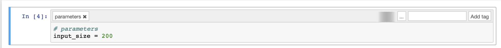

# Partitioning
* **part one** creates the container _(we are in this one right now)_
* **part two** spins up the airflow and builds DAGs
* **part three** calls the AWS(local stack in our mock case) to execute our tasks


# What will get done
We will create a **dockered parametrizable Jupyter notebook** that will be later used as baseline for DAGs and scheduled by Apache Airflow. All that while running in the cloud.

# Technologies used
* data science starter pack as an example notebook (`pandas`, `numpy`, `seaborn`)
* `Jupyter` (with `papermill` extension)
* `Docker` 

# Steps required:
### 1. Set up jupyter "basic lab environment"
```bash
mkvirtualenv airflow_jupyter --python=python3.6
pip install jupyter ipython [and whatever else you need]
ipython kernel install --user --name=airflow_jupyter
pip install nteract_on_jupyter
pip install papermill[s3]
jupyter nteract
```

**warning** - the name of virtualenv of choice, in this case `airflow_jupyter`, will be used later - because we'd rather not clutter our workstation, we could want to use separate kernels for each task. But in the end, the notebook getting scheduled 
expects the kernel to actually exists. We will make sure it actually does, by creating it later in the Dockerfile, just before spinning up the notebook.  

### 2. Create example notebook
```python
%matplotlib inline
import pandas as pd
import numpy as np
import matplotlib.pyplot as plt
x = np.arange(0, input_size, 1)
y = np.random.gamma(2., 2., input_size)
plt.figure(figsize=(18,10))
plt.scatter(x, y, c='r')
plt.show()
```
### 3. Add parameters cell
enable


and then create cell:




### 4. Run `papermill` (with no docker yet)
depending on your catalog structure the command will look approximately like this:
```bash
papermill task_1/code.ipynb task_1/output/code_exectuion_1.ipynb -f task_1/params.yaml
```
if all went well proceed to the next step
### 5. Wrap up the notebook in a docker container
first off, dump a requirements.txt to task folder as each task should have its own, as tiny as possible, virtual environment
```python
pip freeze > requirements.txt
```
Now create a basic `Dockerfile` that spins up `run.sh`(which we will create later)

**Note that while `jessie` is not always the best choice of Docker base image taking its size into consideration, the benefit of `alpine` quickly diminishes when using huge libraries like numpy, scipy or pandas.** If you are comfortable with Docker and Linux, feel free to use `alpine` as your base image. This will require however, tweaking the Dockerfiles a lot.

Make sure that your name of virtualenv matches correctly in the following file:
```dockerfile
FROM python:3.6.8-jessie

COPY requirements.txt /

# will be overwriten should `docker run` pass a proper env
ENV EXECUTION_ID 111111

# match the name of jupyter's kernel where necessary
RUN pip install virtualenv
RUN virtualenv -p python3 airflow_jupyter
RUN /bin/bash -c "source /airflow_jupyter/bin/activate"
RUN pip install -r /requirements.txt
RUN ipython kernel install --user --name=airflow_jupyter

RUN mkdir notebook
RUN mkdir notebook/output

COPY code.ipynb ./notebook/code.ipynb
COPY params.yaml ./notebook/params.yaml
COPY run.sh ./notebook/run.sh

WORKDIR notebook
ENTRYPOINT ["bash", "./run.sh"]
```

### 6. Create `params.yaml` and `run.sh`
now create a little `run.sh` oneliner to run the script: (we might replace `run.sh` to `run.py` at later time, when Airflow will inject into container more params (unique container id, execution id, database or cloud credentials etc.) and more steps will be necessary to ensure proper execution)
```bash
#!/usr/bin/env bash

papermill code.ipynb output/code_execution_${EXECUTION_ID}.ipynb -f params.yaml --log-output
```
and the `params.yaml` file(which will be mounted and overwritten by Airflow in future)
```yaml
input_size: 500

# default parameters, this file should be overwritten by airflow
```
### 7. Run the example
Build the container:

`docker build . -t task1`

and then run it:
```bash
>>> docker run -it -e EXECUTION_ID=444444 task1
    Input Notebook:  code.ipynb
    Output Notebook: output/code_execution_444444.ipynb
    Executing notebook with kernel: airflow_jupyter
    Executing Cell 1---------------------------------------
    Ending Cell 1------------------------------------------
    Executing Cell 2---------------------------------------
    Ending Cell 2------------------------------------------
    Executing Cell 3---------------------------------------
    <Figure size 1296x720 with 1 Axes>
    Ending Cell 3------------------------------------------
```
Note that the `EXECUTION_ID` actually got passed in correctly. We can also retrieve the resulting notebook using docker cp:
```bash
>>> docker ps -a | grep task1 -m 1 | awk '{print $1}'
124fad5be5e0
```
and then
```
>>> docker cp 124fad5be5e0:/notebook/output/code_execution_444444.ipynb ./
```

# But what we have done?
Well, now _somebody else_(another system, that is) can run our task with little dependencies and knowledge about what the task actually does. It is a huge deal, as will be shown in the second part.

